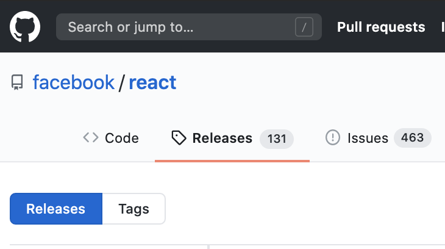
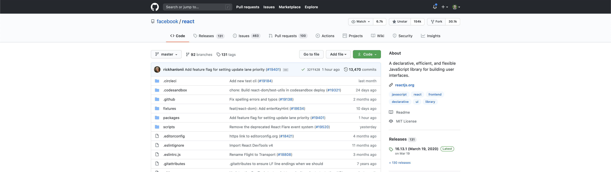
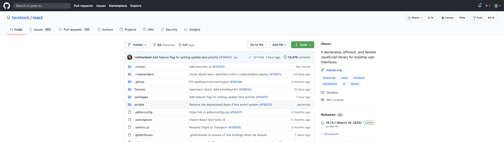

# github++ (Chrome Extension)
Opinionated tweaks to the github redesign in a fancy chrome extension

### [Add to chrome](https://chrome.google.com/webstore/detail/github%20%20/jldinbohjcbakkjhlpmepaamcajlhbdb)

  

### What?
Github released a [redesign in June 2020](https://github.blog/changelog/2020-06-23-design-updates-to-repositories-and-github-ui/) that was mostly **great**, but there was a few things that I think could be improved. This project aims to tweak the github UI to make it easier to use.

### Features

- 👉Center the top nav 👈
- 👉Center the main repo nav 👈
- 🎉Add a top level tab for releases
- TODO: Quick filter collapse pull request files
- TODO: Customizable
- TODO: Collapse files to bring README up

#### Top level releases

  

#### Center navigation 🚀

  

#### BEFORE

  

